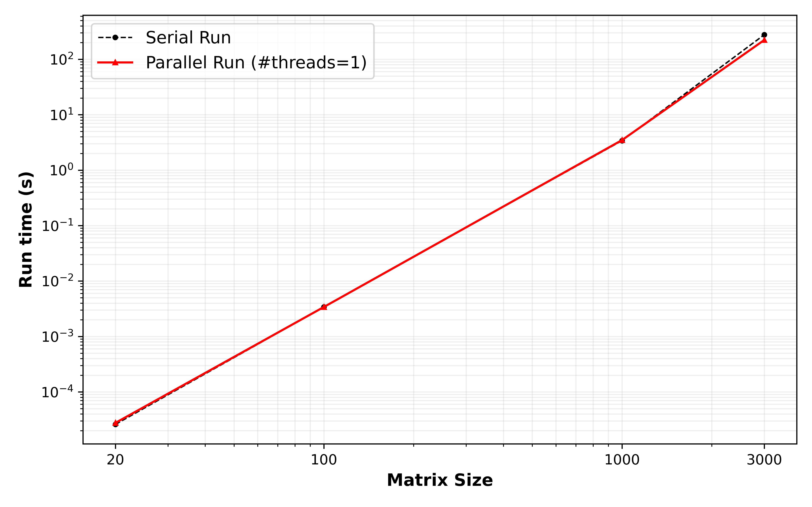
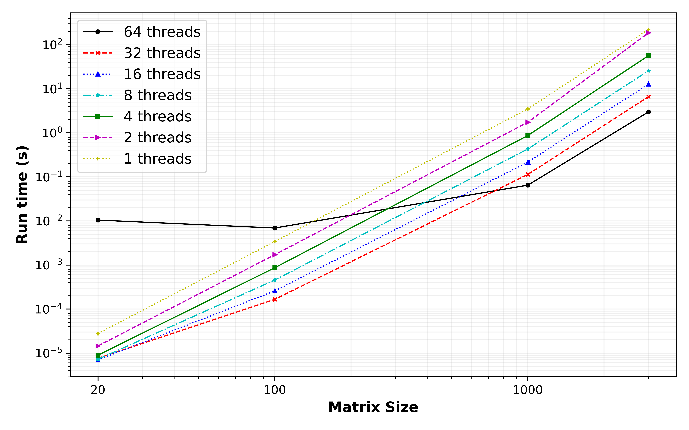
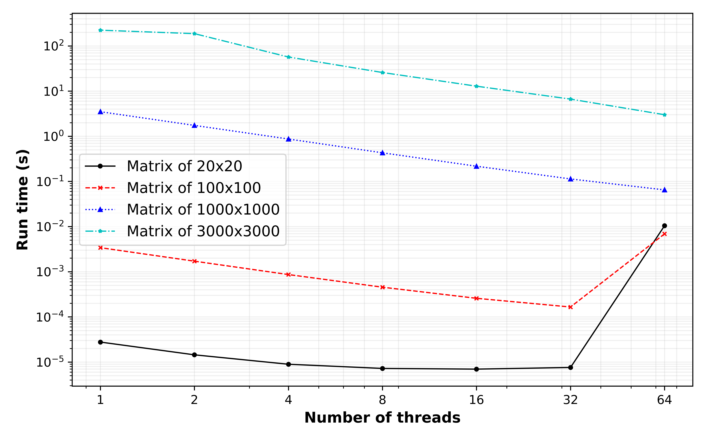

# Project 4 (OpenMP and Hybrid Parallelism) Team 2 Report

## Part 1: OpenMP Matrix-Matrix Multiplication

#### Warm-up question: What strategies could you use to add parallelism using OpenMP threading to this kernel? Is each of the three loops threadable?

We can simply use `#pragma` to parallelize the outer-most loop using the `OpenMP`. This loop goes over each row of the first matrix, and since these calculations are independent, this is the best option for parallelization. 

One may parallelize the middle loop as well. Although, this loop goes over the columns of the second matrix and therefore, there is a possibility that different threads tries to write on the same element. That's why it's not recommended. 

As the last option, parallelization of the inner most loop is not also recommended. The main reason is that this way, the overheading time from `OpenMP` might be much more significant than the advantage gained from the parallelization. 

#### Q1: Modify your MMM code from Project 1 to implement OpenMP threading.

The code for MMM was modified as it can be found under `./src/matrix_math.cpp`. For the parallelization using only `OpenMP`, the MMM nested loop was modified as follows. It was later compiled using the `gcc` compiler using the proper openMP flag.

``` C++
// Create a parallel region
#pragma omp parallel for default(none) shared(A,B,C,m,n) private(sum)
for(int i = 0; i < m; i++){
    for(int j = 0; j < n; j++){
        sum = 0;
        for(int k = 0; k < n; k ++){
            sum += A[i][k] * B[k][j];
        }

        C[i][j] = sum;
    }
}
```

#### Q2. Compute the time-to-solution of your MMM code for 1 thread to the non-OpenMP version. Any matrix size `N` will do here. Does it perform as you expect? If not, consider the OpenMP directives you are using.

The results of the serial run against the parallel run with only 1 thread is shown in the following figure. As this figure shows, the Serial code had slightly higher runtimes!!!!!! It should be opposite.

However, as the matrix size increases, the difference between the runtimes reduces, as the overhead time required for setting the `OpemMP` up compared to the total run time is much smaller. 



#### Q3. Perform a thread-to-thread speedup study of your MMM code either on your laptop or HPCC. Compute the total time to solution for a few thread counts (in powers of 2): `1,2,4,...T`, where T is the maximum number of threads available on the machine you are using. Do this for matrix sizes of `N=20,100,1000`.

The parallel code was run in HPCC using the 





4. Plot the times-to-solution for the MMM for each value of `N` separately as functions of the the thread count `T`. Compare the scaling of the MMM for different matrix dimensions.





5. Verify that for the same input matrices that the solution does not depend on the number of threads.


## Part 2: Adding OpenMP threading to a simple MPI application
- The print statement was wrapped in the `omp parallel` region after the MPI initialization environment.
- The `MPI_Init` was modified to `MPI_Init_thread` to allow for thread support. The level of thread support needed is the `MPI_THREAD_FUNNELED`. It's good to point out that using just `MPI_Init` performs similarly as the `MPI_Init_thread`.
- `<omp.h>` was used to extract the unique thread number using `omp_get_thread_num()` in printing the `Hello World!`.
- The image below shows the differences between setting the threads environment variable number and not.


- Within the code, we set the print statement to only print when we have `rank == 1`. Therefore, we only have one print statement per thread. If we remove this constraints on the rank, we will have two print statements per thread. 
On the left side of the image, we see that the mpi utilized all the available threads, but when we specified the `number of thread = 4`, the mpi was limited to print using `4` threads.
- The image below shows the results obtained when the constraints on the rank is removed, and the rank number is printed together with the thread number used.

- From both figures, we see clearly that the print statement did not follow any particular order, and this is because of the non-deterministic scheduling of threads and processes.

## Part 3: Hybrid Parallel Matrix Multiplication
