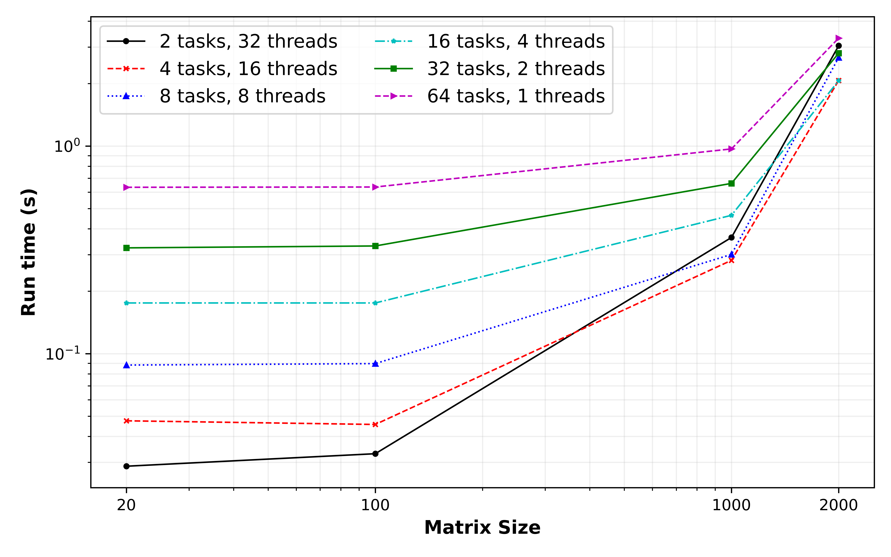

# Project 4 (OpenMP and Hybrid Parallelism) Team 2 Report

## Part 1: OpenMP Matrix-Matrix Multiplication

### Warm-up question: What strategies could you use to add parallelism using OpenMP threading to this kernel? Is each of the three loops threadable?

We can simply use `#pragma` to parallelize the outer-most loop using the `OpenMP`. This loop goes over each row of the first matrix, and since these calculations are independent, this is the best option for parallelization. 

One may parallelize the middle loop as well. Although, this loop goes over the columns of the second matrix and therefore, there is a possibility that different threads tries to write on the same element. That's why it's not recommended. 

As the last option, parallelization of the inner most loop is not also recommended. The main reason is that this way, the overheading time from `OpenMP` might be much more significant than the advantage gained from the parallelization. 

### Q1: Modify your MMM code from Project 1 to implement OpenMP threading.

The code for MMM was modified as it can be found under `./src/matrix_math.cpp`. For the parallelization using only `OpenMP`, the MMM nested loop was modified as follows. It was later compiled using the `gcc` compiler using the proper openMP flag.

``` C++
// Create a parallel region
#pragma omp parallel for default(none) shared(A,B,C,m,n) private(sum)
for(int i = 0; i < m; i++){
    for(int j = 0; j < n; j++){
        sum = 0;
        for(int k = 0; k < n; k ++){
            sum += A[i][k] * B[k][j];
        }

        C[i][j] = sum;
    }
}
```

### Q2. Compute the time-to-solution of your MMM code for 1 thread to the non-OpenMP version. Any matrix size `N` will do here. Does it perform as you expect? If not, consider the OpenMP directives you are using.

The results of the serial run against the parallel run with only 1 thread is shown in the following figure. As this figure shows, the run time of the serial and parallel codes were almost identical. The plot was generated in a log-log scale to see any slight difference for the small matrices (`N=20`), but still the runtimes were very close. It is noted that the timing was measured using the average of 100 iterations to avoid the noise effect. 

It is noted that the expectation was the serial code run faster, as the parallel code had some overhead timing for dividing the work between the threads (here only 1 thread). However, after group discussion it is believed that considering the problem size, this overhead time is so small that cannot be recognized withint the data variation noise. 


### Q3. Perform a thread-to-thread speedup study of your MMM code either on your laptop or HPCC. Compute the total time to solution for a few thread counts (in powers of 2): `1,2,4,...T`, where T is the maximum number of threads available on the machine you are using. Do this for matrix sizes of `N=20,100,1000`.

The below figure shows the runtime of the parallel MMM code at different sizes and using different number of threads. As this figure shows, the highest runtime was recorded for using only 1 thread (similar to the serial computation), but with increase in the number of threads (implementation of parallel computing), the run time curve shifts down and significantly reduces (considering the log-log scale). As an example, implementation of the 64 threads can improve the runtime of a matrix of 3000x3000 for about 74 times compared to the serial computation. 

However, this figure shows some inconsistent results when 64 threads are used. In this case, the runtime for the matrix sizes of `N=20` and `N=100` is considerably higher than even the serial computation. The main reason for this observation is that the matrix size in these cases were very small and each thread can only do one or two (even if any) iterations. Therefore, the overhead time to set up the parallel section and divide the jobs by the `OpenMP` can be significantly high and that caused such inconsistent and unexpected results. Moreover, it can be seen that by increasing the matrix size to 3000x3000, the application of 64 threads found its way back as the most efficient solution.


This graph can also be analyzed in terms of the scaling problem, in which the ideal case is a straight line and when that performance line shifts down, it shows the beneficial effect of the parallel computing. However, it should be noticed that this ideal straight line for the cases with 32 and 64 threads cannot be ploted, because the size of matrices at the first two data points (`N=20,100`) are too small. Otherwise, the results from this graph makes perfect sense. 

### Q4. Plot the times-to-solution for the MMM for each value of `N` separately as functions of the the thread count `T`. Compare the scaling of the MMM for different matrix dimensions.

The scaling as a function of the number of threads are shown in the figure below. As this figure shows, the runtime of the MMM calculations reduces with increasing the number of threads, which means the workload was divided between different threads and therefore, the runtime efficiency increases. Such trend can be ideally seen for the matrix size of 1000x1000 and 3000x3000. However, for the smaller matrix sizes, this reduction trend was distrupted when 64 threads were used (and even 32 threads for `N=20`), where the reason was previously explained in the previous question.


5. Verify that for the same input matrices that the solution does not depend on the number of threads.

In order to verify the outputs, the A, B, and C matrixes ($C = A \times B$) were saved as CSV file at the end of the program, for each combination of matrix size, number of threads used and serial/parallel run. The input A and B matrices were then read in Python and the exact C ($C_{exact}$) was calculated by which the average total error was calculated using the following equation:

$Error =  \frac{\sum |C_{exact} - C|}{\text{Num data}}$

The results were calculated and showed in the below table. As this table shows, the average total error for all different combinations were less than $10^{-13}$, and therefore, all solutions were assumed ACCURATE.

| Run Type | Matrix size | Num Threads | Avg Total Error | 
| -- | -- | -- | -- |
| Serial | 20   | 1 | $1.59 \times 10^{-16}$ |
| Serial | 100  | 1 | $6.36 \times 10^{-16}$ |
| Serial | 1000 | 1 | $8.38 \times 10^{-15}$ |
| Serial | 3000 | 1 | $2.46 \times 10^{-14}$ |
| Parallel | 20   | 1 | $1.46 \times 10^{-16}$ |
| Parallel | 100  | 1 | $6.35 \times 10^{-16}$ |
| Parallel | 1000 | 1 | $8.39 \times 10^{-15}$ |
| Parallel | 3000 | 1 | $2.46 \times 10^{-14}$ |
| Parallel | 20   | 2 | $1.46 \times 10^{-16}$ |
| Parallel | 100  | 2 | $6.35 \times 10^{-16}$ |
| Parallel | 1000 | 2 | $8.37 \times 10^{-15}$ |
| Parallel | 3000 | 2 | $2.46 \times 10^{-14}$ |
| Parallel | 20   | 4 | $1.40 \times 10^{-16}$ |
| Parallel | 100  | 4 | $6.33 \times 10^{-16}$ |
| Parallel | 1000 | 4 | $8.40 \times 10^{-15}$ |
| Parallel | 3000 | 4 | $2.46 \times 10^{-14}$ |
| Parallel | 20   | 8 | $1.46 \times 10^{-16}$ |
| Parallel | 100  | 8 | $6.25 \times 10^{-16}$ |
| Parallel | 1000 | 8 | $8.38 \times 10^{-15}$ |
| Parallel | 3000 | 8 | $2.46 \times 10^{-14}$ |
| Parallel | 20   | 16 | $1.47 \times 10^{-16}$ |
| Parallel | 100  | 16 | $6.35 \times 10^{-16}$ |
| Parallel | 1000 | 16 | $8.38 \times 10^{-15}$ |
| Parallel | 3000 | 16 | $2.46 \times 10^{-14}$ |
| Parallel | 20   | 32 | $1.41 \times 10^{-16}$ |
| Parallel | 100  | 32 | $6.37 \times 10^{-16}$ |
| Parallel | 1000 | 32 | $8.36 \times 10^{-15}$ |
| Parallel | 3000 | 32 | $2.46 \times 10^{-14}$ |
| Parallel | 20   | 64 | $1.55 \times 10^{-16}$ |
| Parallel | 100  | 64 | $6.11 \times 10^{-16}$ |
| Parallel | 1000 | 64 | $8.36 \times 10^{-15}$ |
| Parallel | 3000 | 64 | $2.46 \times 10^{-14}$ |

## Part 2: Adding OpenMP threading to a simple MPI application
- The print statement was wrapped in the `omp parallel` region after the MPI initialization environment.
- The `MPI_Init` was modified to `MPI_Init_thread` to allow for thread support. The level of thread support needed is the `MPI_THREAD_FUNNELED`. It's good to point out that using just `MPI_Init` performs similarly as the `MPI_Init_thread`.
- `<omp.h>` was used to extract the unique thread number using `omp_get_thread_num()` in printing the `Hello World!`.
- The image below shows the differences between setting the threads environment variable number and not.


- Within the code, we set the print statement to only print when we have `rank == 1`. Therefore, we only have one print statement per thread. If we remove this constraints on the rank, we will have two print statements per thread. 
On the left side of the image, we see that the mpi utilized all the available threads, but when we specified the `number of thread = 4`, the mpi was limited to print using `4` threads.
- The image below shows the results obtained when the constraints on the rank is removed, and the rank number is printed together with the thread number used.

- From both figures, we see clearly that the print statement did not follow any particular order, and this is because of the non-deterministic scheduling of threads and processes.

## Part 3: Hybrid Parallel Matrix Multiplication

### Q1 & Q2: Add MPI to  you OpenMP MMM code by distributing the rows of one of the input matrices across MPI ranks. Carry out a performance study in which you vary the number of MPI ranks and OpenMP threads.

The MMM code was modified to include hybrid parallelization using both `OpenMP` and `MPI` methods, which can be found under `src/matrix_multiplication_hybrid.cpp`. In this code, the `MPI` works on the outer-most loop which is over the rows of the first matrix and then the `OpenMP` parallelization works on the middle loop and therefore make the program more efficient. 

After development of the code, it was submitted to the HPCC at different combinations of the tasks and threads per tasks, by keeping the total number of physical cores constant and equal to 64. Therefore, we have the following combinations:

| # tasks | # thread per task | # total cores| 
| -- | -- | -- |
| 2 | 32 | 64 |
| 4 | 16 | 64 |
| 8 | 8 | 64 |
| 16 | 4 | 64 |
| 32 | 2 | 64 |
| 64 | 1 | 64 |

The results are shown in the figure below. As this figure shows, the best performance of the hybrid parallel computation for the small matrix sizes were acheieved when the number of tasks are low and more threads are used. This observation makes sense as the `MPI` tasks were applied on the outer-most rows of the first matrix and less individual tasks with more threads can reduce the small communication messages through the `MPI` and therefore improve the efficiency. This way, the amount of comminucation compared to the actual computations were much less and therefore we have more efficient calculations overall. 



On the other hand, as we increase the matrix size, the computations either on threads (using `OpenMP`) or ranks (through `MPI` communication) were taking most of the time and the time required for communication will be much less than the time for computation. Therefore, all different combinations of the tasks and threads will be converged to an optimum point as the size of the matrix increases. 

In another word, these results confirms that for small matrices it is more efficient to use on node calculations and parallel the code using the `OpenMP`. However, as the size of the matrix increases, we might not be able to fit the calculation on one node, and therefore we need to use `MPI` communication to use more than one node. In this case, if the matrix size is large enough, the application of the hybrid parallelization method can be optimum regardless of the different combinations used.

